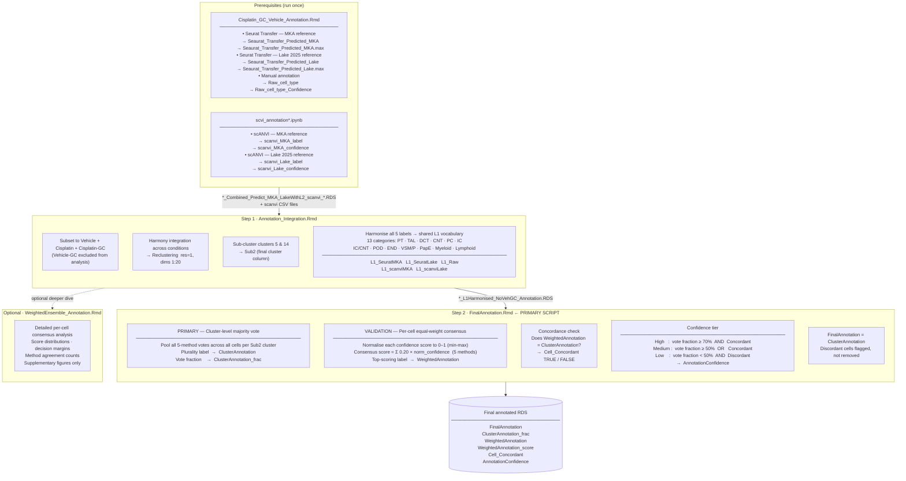

# Cisplatin GC Vehicle — Cell Type Annotation Pipeline

## Pipeline diagram

---

## Script run order

| Order | Script | Role | Key output columns |
|---|---|---|---|
| 0a | `Cisplatin_GC_Vehicle_Annotation.Rmd` | Seurat Transfer + manual annotation | `Seaurat_Transfer_Predicted_*`, `Raw_cell_type` |
| 0b | `scvi_annotation*.ipynb` | scANVI predictions | `scanvi_*_label`, `scanvi_*_confidence` |
| 1 | `Cisplatin_GC_Vehicle_Annotation_Integration.Rmd` | Reclustering + L1 harmonisation | `L1_SeuratMKA`, `L1_SeuratLake`, `L1_Raw`, `L1_scanviMKA`, `L1_scanviLake` |
| **2** | **`Cisplatin_GC_Vehicle_FinalAnnotation.Rmd`** | **Cluster majority vote + per-cell consensus + tiers** | `FinalAnnotation`, `ClusterAnnotation_frac`, `WeightedAnnotation`, `Cell_Concordant`, `AnnotationConfidence` |
| (opt) | `Cisplatin_GC_Vehicle_WeightedEnsemble_Annotation.Rmd` | Detailed per-cell consensus analysis for supplementary figures | `WeightedAnnotation_score`, `WeightedAnnotation_margin` |

> **Note:** `FinalAnnotation.Rmd` is self-contained — it computes the per-cell consensus internally and does not depend on the WeightedEnsemble script having been run first.

---

## Design rationale

### Why cluster-level majority vote as the primary label?

Single-cell data is inherently noisy (dropout, ambient RNA). Annotating at the cluster level — pooling votes from all five methods across all cells within each Seurat sub-cluster — averages out per-cell noise. This is the standard approach in published kidney single-cell studies and is the most defensible for a peer-reviewed paper.

### Why keep the per-cell consensus as a validation layer?

The per-cell consensus provides an independent cell-level check. Cells where it disagrees with the cluster label (`Cell_Concordant = FALSE`) may represent transitional states, doublets, or cluster boundary cells. Flagging them rather than silently overriding them preserves this biological information for downstream interpretation.

### Why normalise confidence scores?

Seurat `prediction.score.max`, scANVI posterior probability, and manual confidence are measured on different scales. Min-max normalisation to [0, 1] ensures each method's confidence contributes comparably before summing.

### Why equal weights?

All five methods are weighted equally (0.20 each). No published benchmark directly comparing all five methods on mouse kidney single-cell data is available, making equal weighting the most conservative and reviewer-defensible choice.

| Method column | Confidence column | Weight |
|---|---|---|
| `L1_SeuratMKA` | `Seaurat_Transfer_Predicted_MKA.max` | 0.20 |
| `L1_SeuratLake` | `Seaurat_Transfer_Predicted_Lake.max` | 0.20 |
| `L1_Raw` | `Raw_cell_type_Confidence` | 0.20 |
| `L1_scanviMKA` | `scanvi_MKA_confidence` | 0.20 |
| `L1_scanviLake` | `scanvi_Lake_confidence` | 0.20 |

---

## Key output files

| File | Script | Contents |
|---|---|---|
| `Cluster_MajorityVote_Final.csv` | FinalAnnotation | Cluster vote tallies and winning label |
| `Cluster_Concordance_ClusterMajority_vs_Weighted.csv` | FinalAnnotation | Per-cluster concordance rate |
| `PerCell_FinalAnnotation_Summary.csv` | FinalAnnotation | Per-cell annotation with all layers |
| `FinalAnnotation_DimPlot.pdf` | FinalAnnotation | UMAP coloured by final annotation |
| `AnnotationConfidence_DimPlot.pdf` | FinalAnnotation | UMAP coloured by High / Medium / Low tier |
| `CellConcordance_DimPlot.pdf` | FinalAnnotation | UMAP highlighting discordant cells |
| `Cluster_VoteFraction_Bar.pdf` | FinalAnnotation | Cluster vote strength bar chart |
| `FinalAnnotation_ConfidenceBar.pdf` | FinalAnnotation | Tier breakdown per cell type |
| `WeightedAnnotation_ScoreSummary.csv` | WeightedEnsemble | Per-cell consensus score distributions |
| `WeightedAnnotation_DimPlot.pdf` | WeightedEnsemble | UMAP coloured by per-cell consensus label |

---

## Methods text for paper

### Cell type annotation

Cell types were annotated using five independent methods applied to the
harmonised single-cell dataset: Seurat label transfer with the MKA reference
(Stuart et al., 2019, *Cell*), Seurat label transfer with the Lake 2025
reference (Lake et al., 2025, *Nature*), scANVI with the MKA reference
(Xu et al., 2021, *Molecular Systems Biology*), scANVI with the Lake 2025
reference, and manual annotation guided by established mouse kidney marker
genes. All five predictions were harmonised to a shared L1 cell-type
vocabulary comprising 13 categories (PT, TAL, DCT, CNT, PC, IC, IC/CNT,
POD, END, VSM/P, PapE, Myeloid, Lymphoid).

The primary cell-type label for each Seurat sub-cluster was determined by
plurality vote, pooling predictions from all five methods across all cells
within each cluster. This cluster-level approach is robust to per-cell
transcriptomic noise inherent in single-cell data. The vote fraction —
the proportion of total votes assigned to the winning label — was recorded
as a measure of cluster-level annotation confidence.

To provide independent per-cell validation, a consensus score was computed
for each cell as the sum of each method's normalised prediction confidence,
with all five methods weighted equally (0.20 each). Prediction confidence
scores from each method were first min-max normalised to [0, 1] to ensure
comparability across methods that use different scoring scales (e.g. Seurat
prediction score versus scANVI posterior probability). The label with the
highest total consensus score was designated the per-cell consensus label.

Cells where the per-cell consensus label agreed with the cluster majority
label were classified as concordant. Cluster annotations were assigned a
confidence tier based on vote fraction and concordance: High (vote fraction
≥ 70% and concordant), Medium (vote fraction ≥ 50% or concordant), and Low
(both criteria unmet). Discordant cells were flagged in the metadata but
retained for downstream analyses. All annotation code is available at
[GitHub repository URL].
